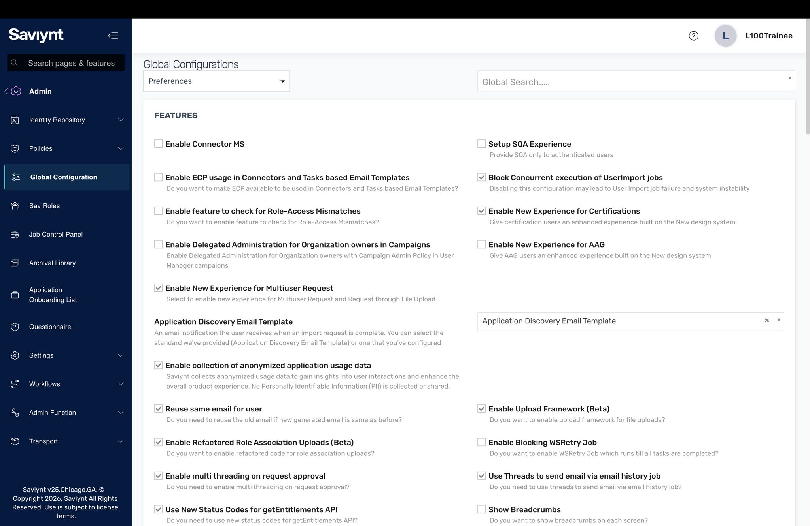
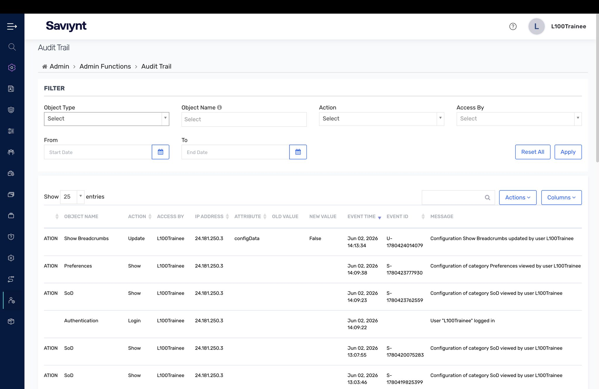
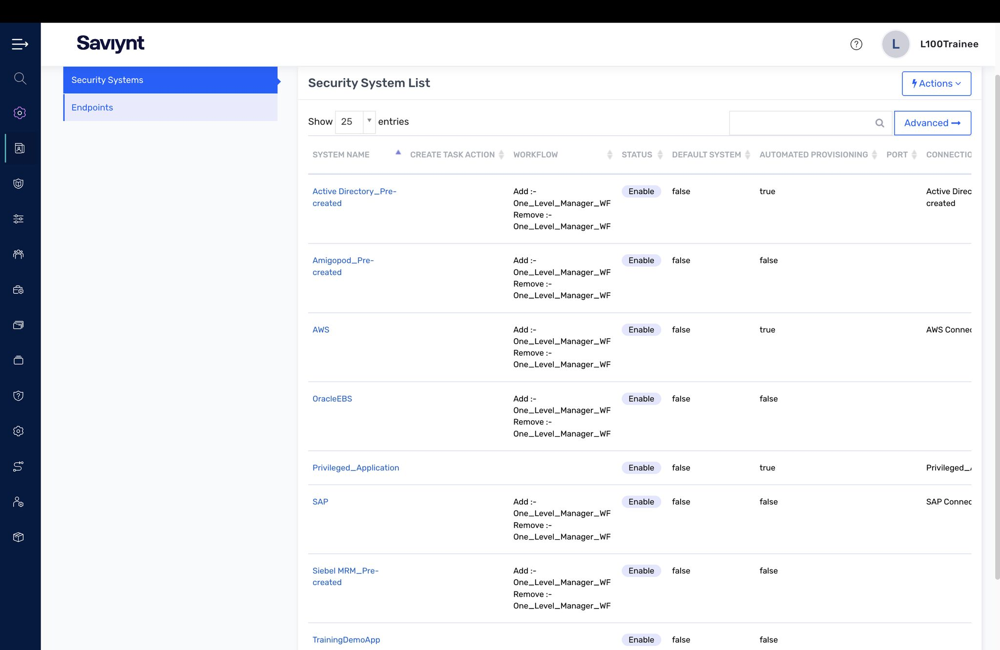
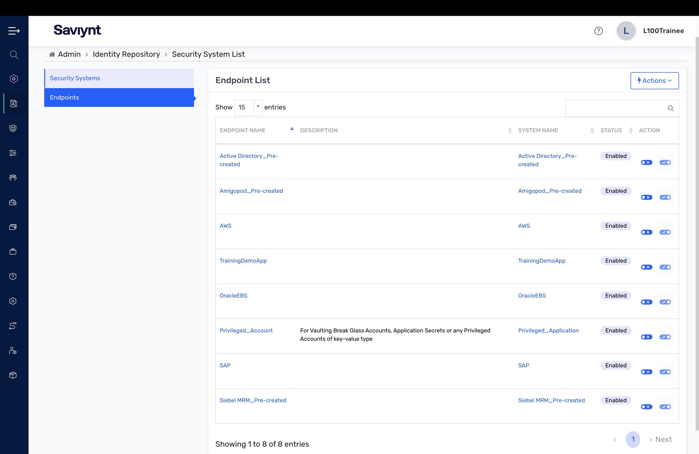
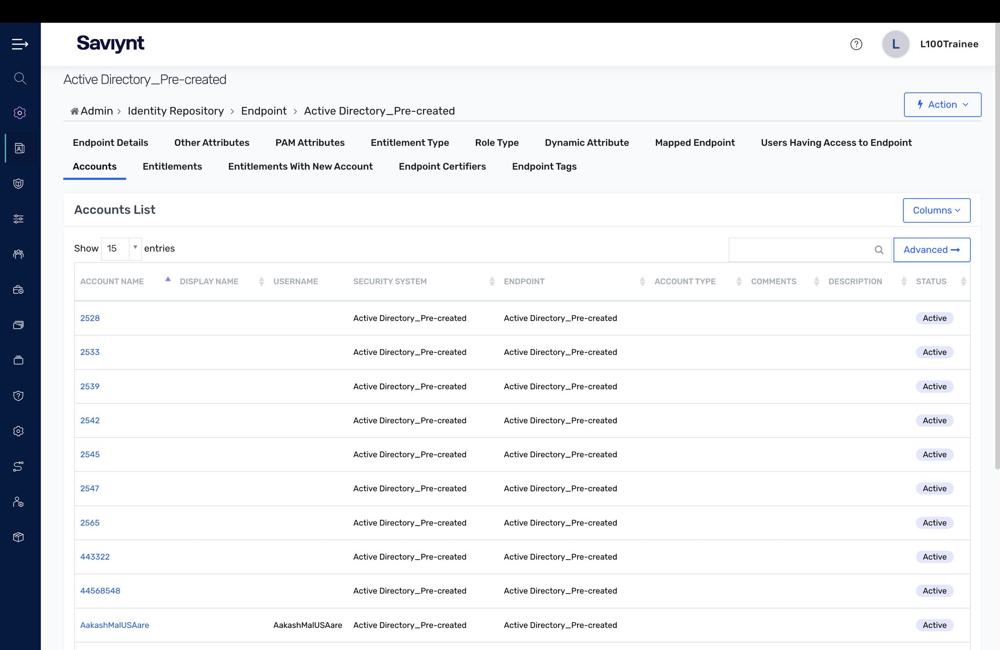

# Lab 1 — Getting Started with Identity Cloud

Before you can govern identities, you have to know your way around the platform. This first lab was about orienting in Saviynt Enterprise Identity Cloud (EIC): global configuration, the audit trail, and the three-tier object model that every integration is built on.

## What I did

- Reviewed **Global Configurations** — the platform-wide preferences and feature toggles that control how the tenant behaves.
- Walked the **Audit Trail** (Admin → Admin Functions → Audit Trail) to see how every configuration change is logged for accountability.
- Explored the **three-tier model**: the Security System list (the application container), its Endpoints (specific instances of the app), and the Accounts that get reconciled into each endpoint.

## Key concepts

- **Security System → Endpoint → Connection** is the backbone of every integration: the Security System is *what* app, the Endpoint is *which instance*, and the Connection is *how to reach it*.
- Everything in EIC is audited. The audit trail is the first place you look when "who changed this?" comes up.

