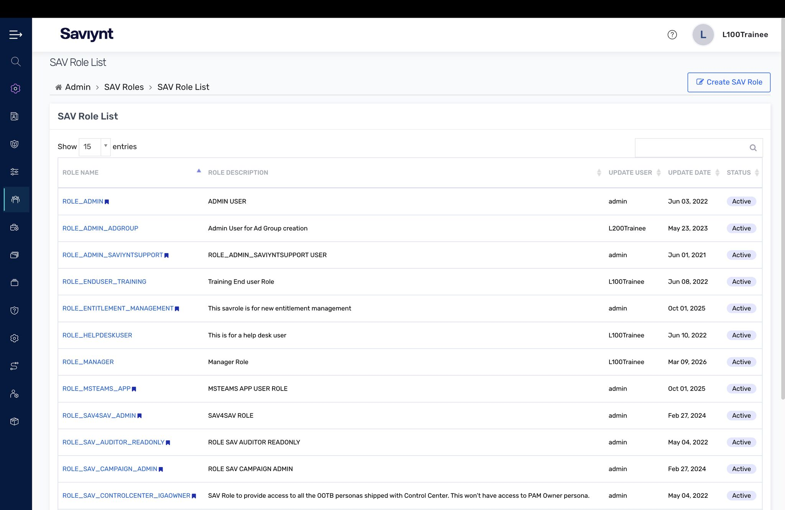
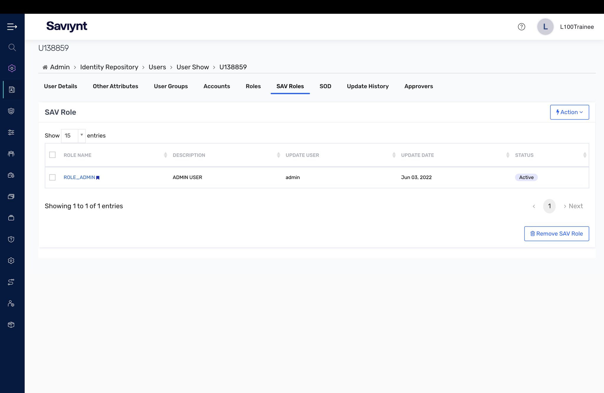
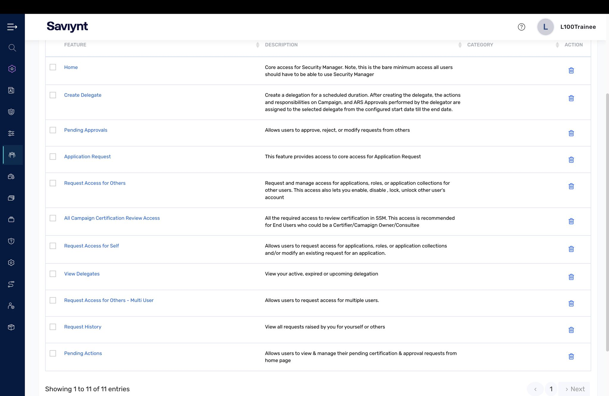
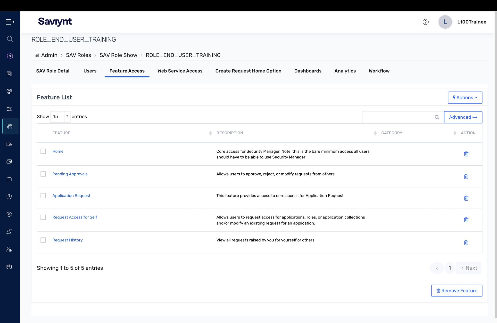
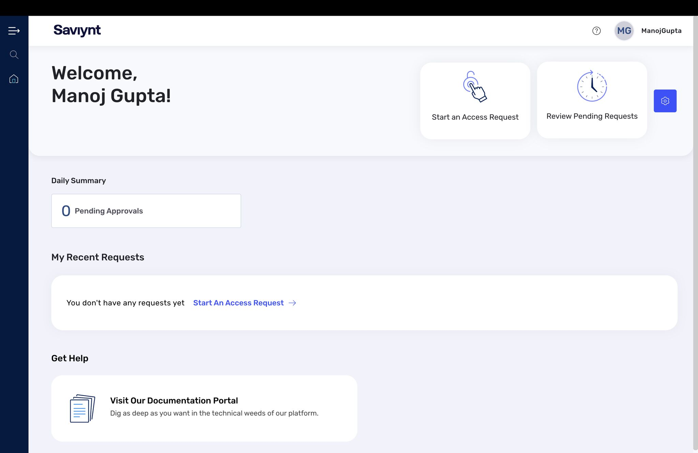

# Lab 2 — Identity Cloud Building Blocks

This lab was about something every IGA program depends on but few people see: SAV roles and the permission model that decides who can do what inside Saviynt itself.

## What I did

- Reviewed the **SAV Role list** — the platform roles that control administrative and end-user capability inside EIC.
- Opened a **user's SAV Role assignment** to see how a person inherits platform access.
- Inspected the **feature/permission set** attached to a SAV role, then the **feature access** for a specific role (ROLE_END_USER_TRAINING).
- Logged in as an end user to confirm the role produced the right **end-user dashboard experience**.

## Key concepts

- SAV roles govern access *to the EIC platform itself* — distinct from the entitlements you provision out to target apps.
- The permission model is least-privilege by design: a trainee end-user role exposes only the request/approval surface, not admin functions.

