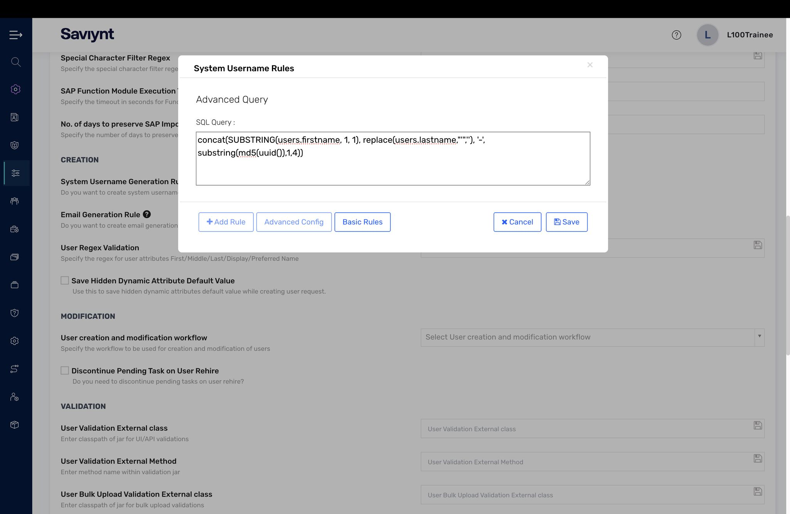
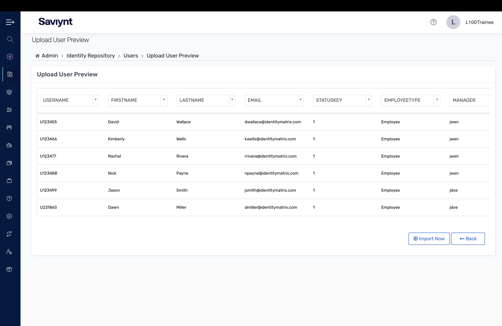
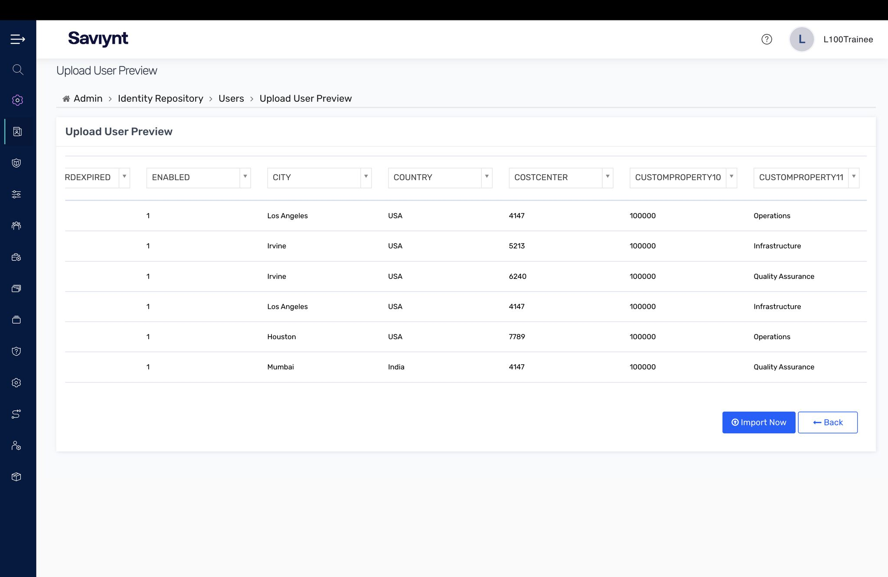
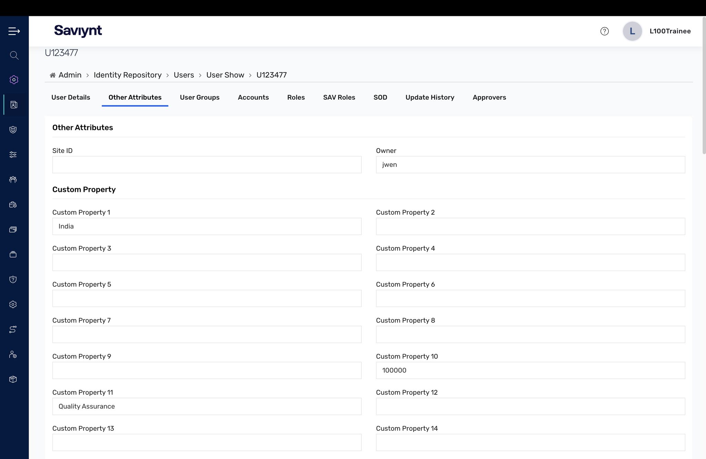
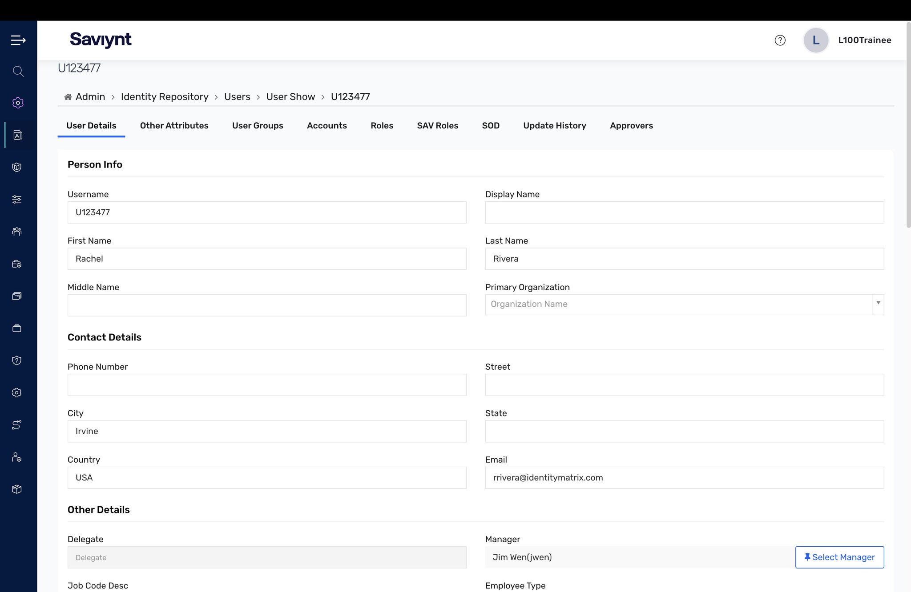

# Lab 3 — Identity Management

Every identity program starts with one question: who are your people? This lab was about getting identities into EIC correctly — the username rules, the bulk import, and the user record that everything downstream inherits from.

## What I did

- Configured **System Username Rules** — the advanced query logic that generates a consistent, unique username for every identity.
- Ran a **bulk user import** and reviewed the **Upload User Preview** across two passes: core attributes (first/last name, email, employee type) and extended attributes (city, country, custom properties).
- Opened a resulting **user record** to verify the **Other Attributes / custom properties** and the **user detail** (personal info, contact details) landed correctly.

## Key concepts

- Username rules enforce consistency at the source — get them wrong and every downstream account inherits the mistake.
- The preview-before-commit step on import is the guardrail that keeps bad HR data out of the warehouse.

