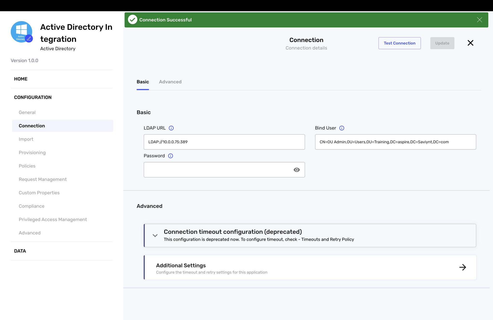
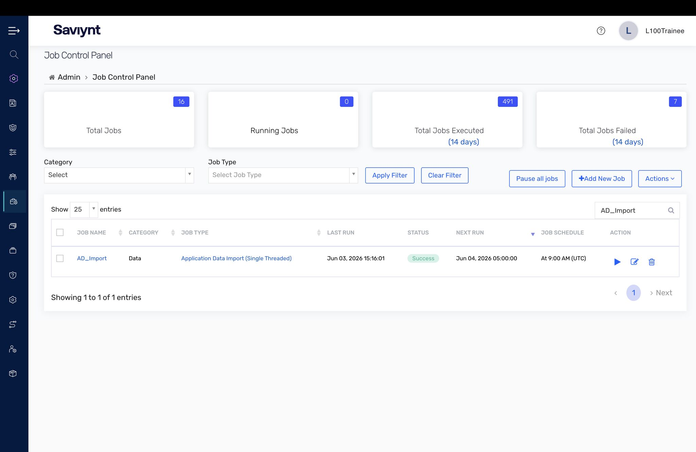
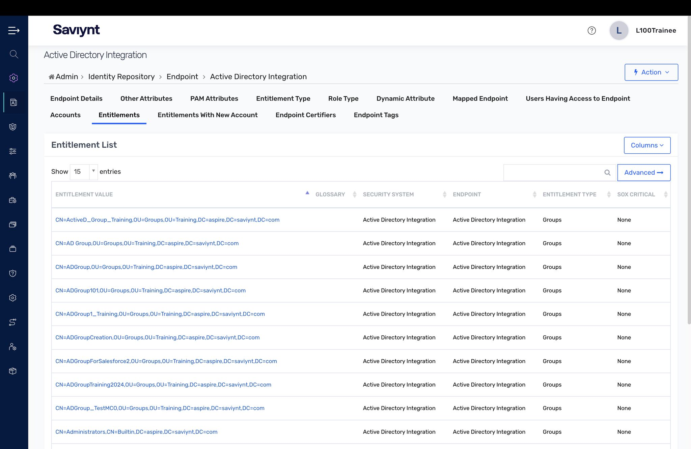
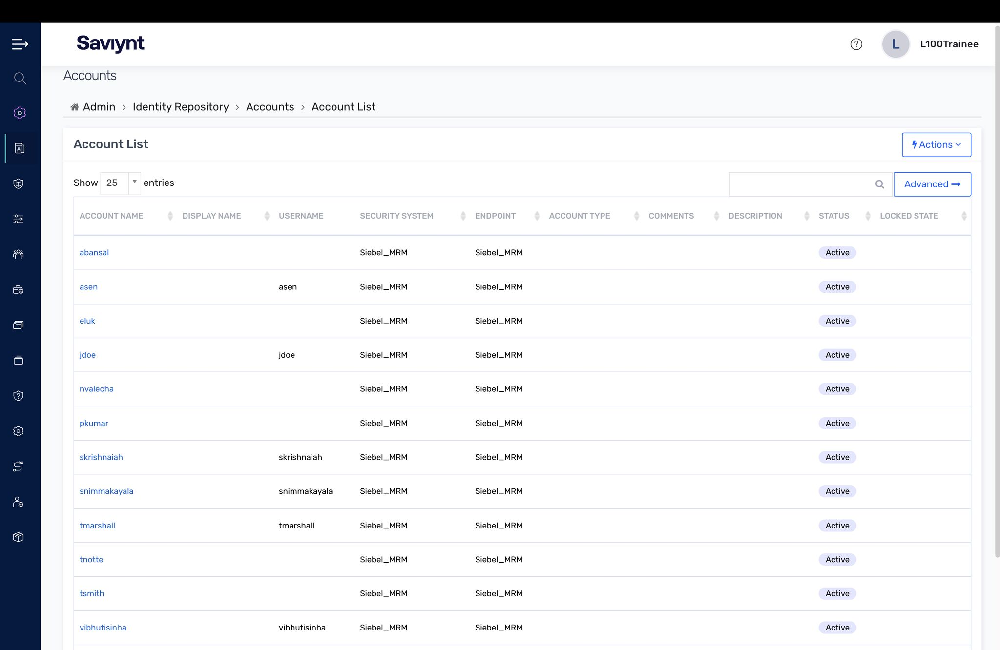
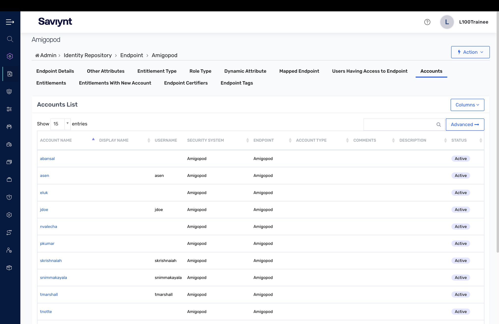
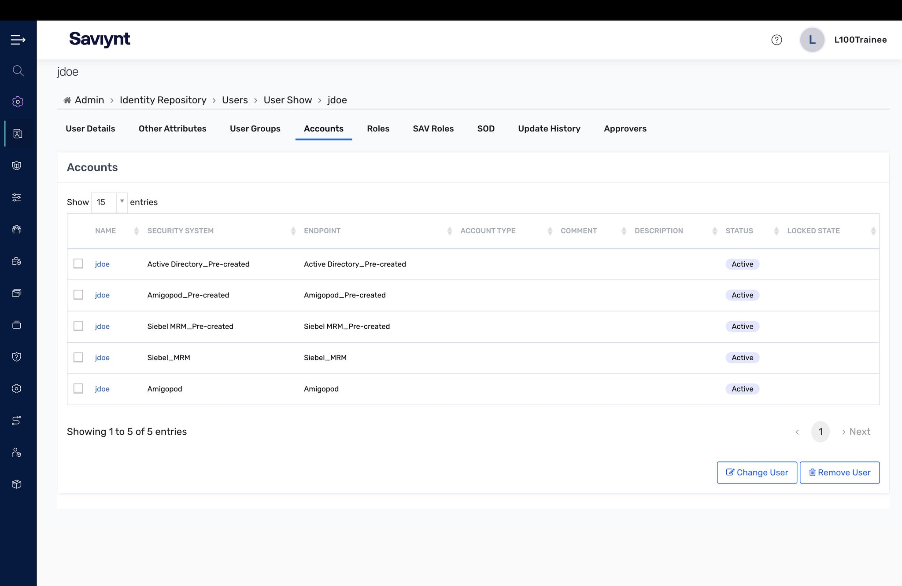

# Lab 4 — Intelligent Application Onboarding

This was the biggest lab yet: connecting a real application to EIC end to end — building the connection, running the import jobs, and validating that accounts and entitlements correlated back to identities.

## What I did

- Built the **Active Directory connection** and confirmed a successful test connection (LDAP URL, credentials, advanced settings).
- Ran the import from the **Job Control Panel** and watched accounts and entitlements aggregate in.
- Reviewed the imported **Entitlement list** and **Accounts list** for the AD endpoint, then a second connected app (Amigopd).
- Confirmed **account correlation** by opening a user and checking the **Accounts tab** — every imported account tied back to an identity.

## Key concepts

- A successful test connection is necessary but not sufficient — the real validation is correlation: an account that doesn't tie to an identity is an orphan, and an invisible risk.
- The Job Control Panel is where you confirm imports actually ran and where you debug them when counts look wrong.

