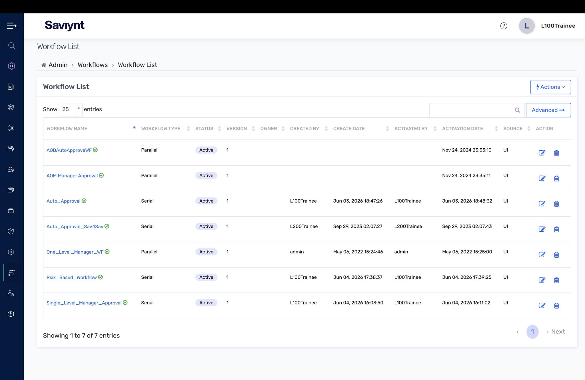
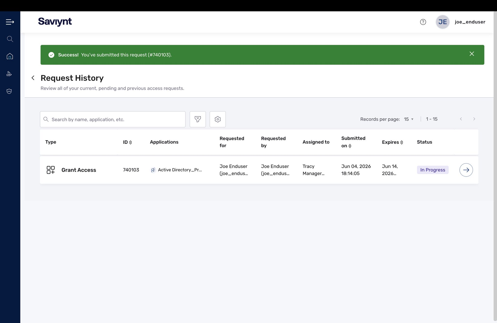
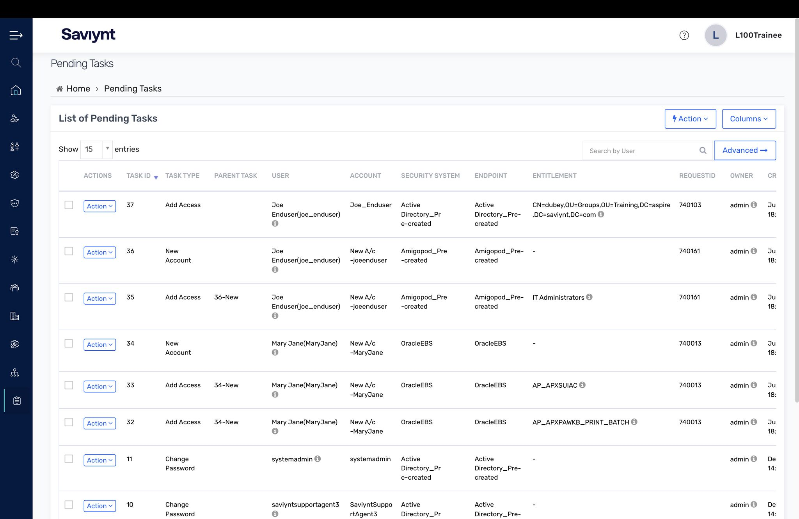
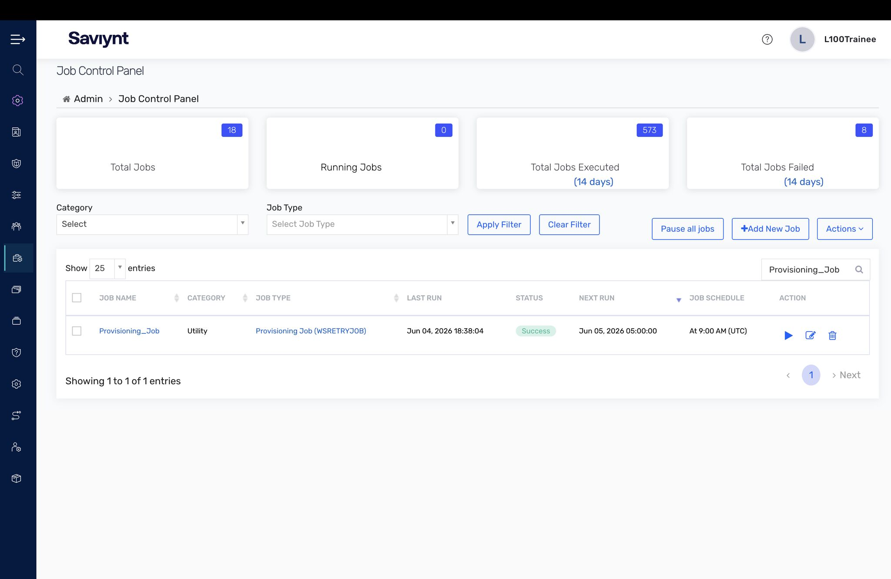
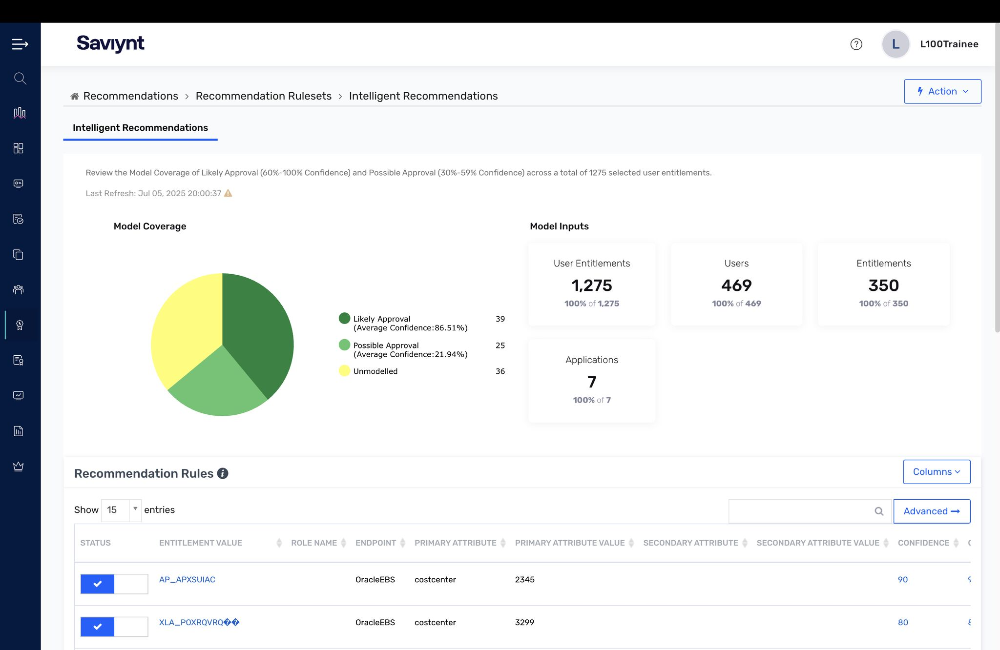
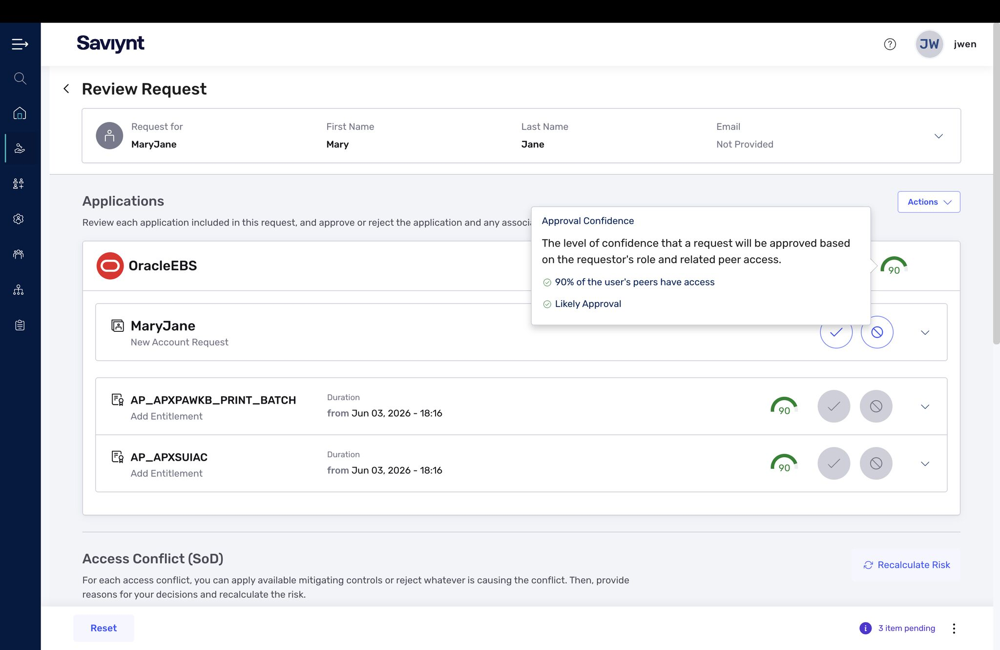

# Lab 5 — Access Request System

If onboarding is how apps get connected, the Access Request System is how people actually get access. This lab covered request workflows, fulfillment, and the intelligence layer that makes requests smarter and safer.

## What I did

- Reviewed the **Workflow list** — the approval workflows that route requests by risk (auto-approval, single-level manager, multi-level risk-based).
- Submitted an access request and followed it through **Request History** to fulfillment.
- Watched the request become real **Pending Tasks** (provisioning tasks) and confirmed the provisioning job in the **Job Control Panel**.
- Explored **Intelligent Recommendations** (peer-based access suggestions with model coverage) and a **Review Request** screen showing approval confidence and an **Access Conflict (SoD)** check.

## Key concepts

- The workflow is a control: match approval friction to the risk of the access, not the org chart.
- Recommendations reduce both friction and risk; the SoD check at approval time stops toxic access combinations before they're granted.

