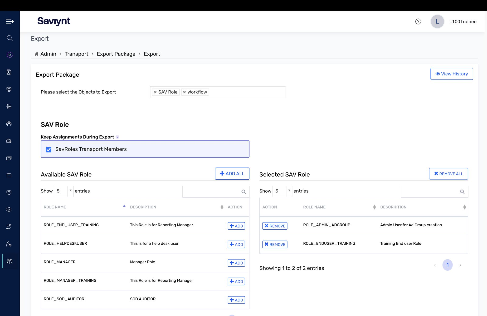

# Lab 6 — Administrator Functions (Transport)

## Objective

Safely move configuration between Saviynt environments using the Transport feature — the controlled way to promote components from one instance to another instead of building straight in production.

## What I did

- Built an **export package** with the components I chose: bundled SAV Roles and workflows into a transport package, including their member assignments so nothing breaks on the other side. The result is a portable `.ZIP`.
- Reviewed the **Export Summary** before exporting — the package contents (SAV Roles, workflows) listed object by object.
- Walked the **import** flow: the Import Summary color-codes new items versus existing ones, so you see exactly what will be created or overwritten before you hit Request. No blind deploys.

## Key concepts

- **You do not build configuration straight in production.** You build it, test it, then transport it.
- **Transport is change management for identity.** Moving config from Test to Production through a packaged, reviewable, workflow-approved process is what keeps a production IGA environment stable.
- A real IGA program is not just clicking around one console — it is the disciplined promotion of tested configuration, the same change-management mindset good engineering teams live by.

## Skills demonstrated

Environment promotion strategy, transport package creation (roles + workflows with member assignments), import preview and conflict review, change management for IGA configuration.

## Lab evidence

Screenshots of this lab (Export Package selection, Export Summary, and workflow transport configuration) are in my LinkedIn write-up: [Administrator Functions post](https://www.linkedin.com/feed/update/urn:li:activity:7469762010344439808/)
