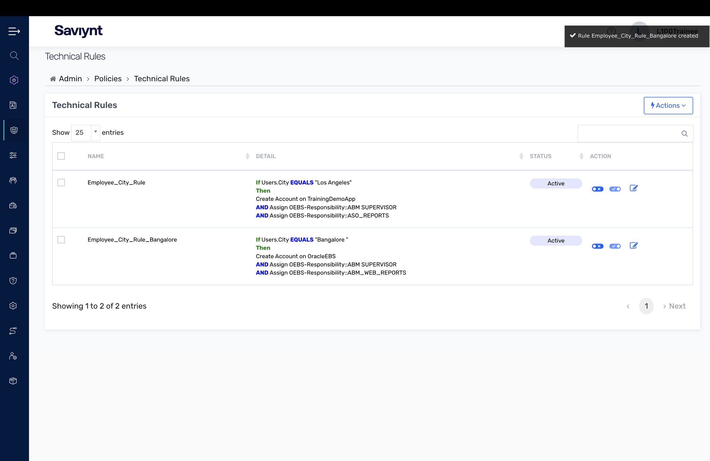
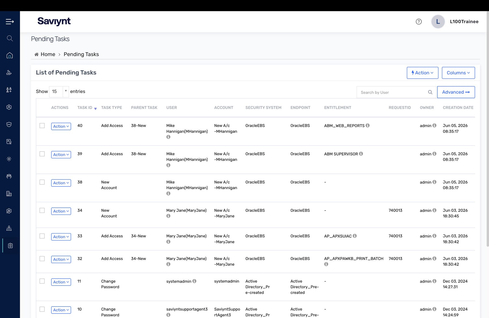
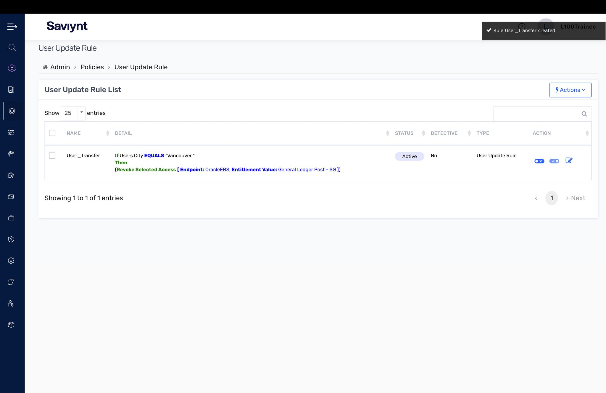
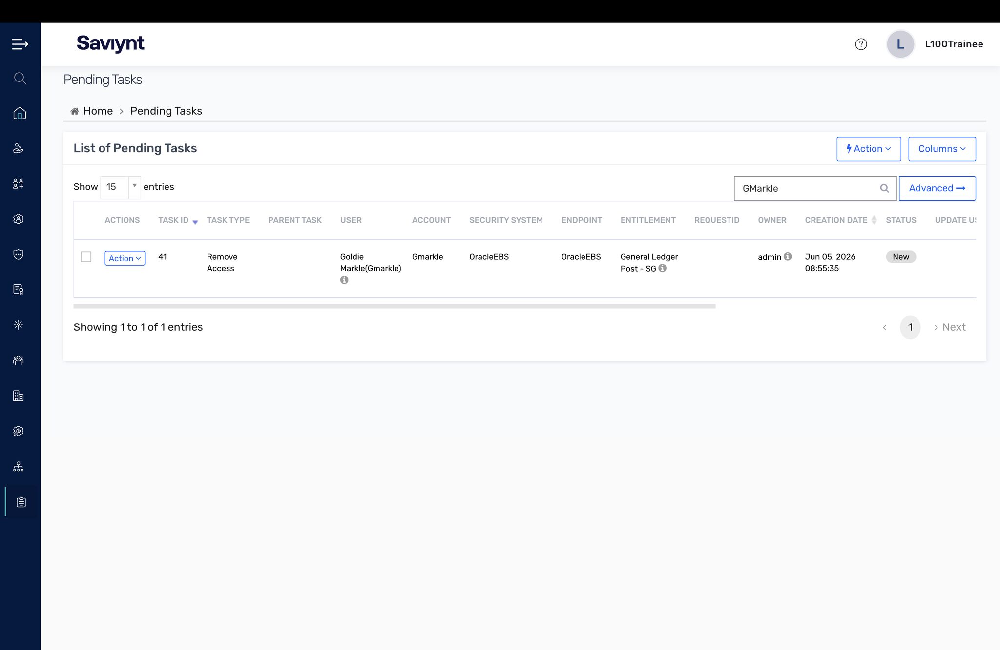
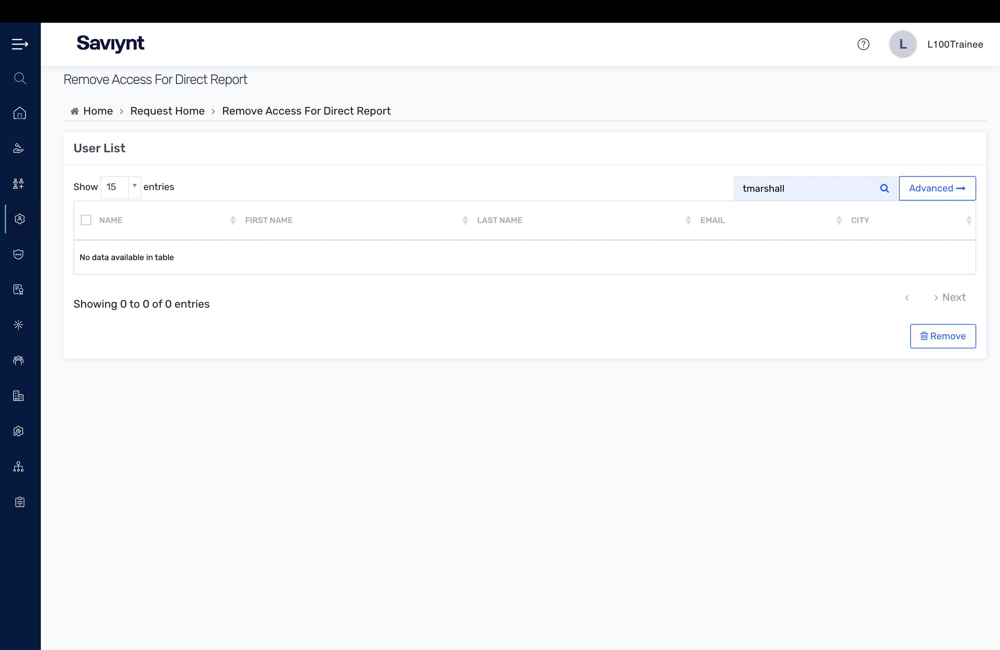
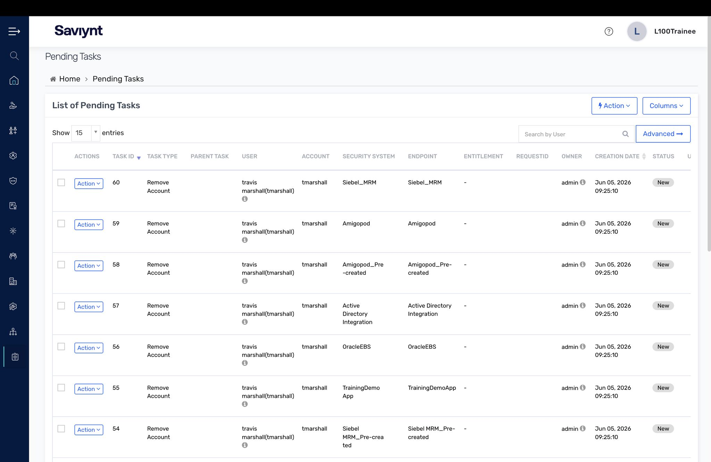

# Lab 6 — Identity Lifecycle Policies

People join, move, and leave an organization constantly. This lab was about automating that access lifecycle with policy rules so it happens without a human clicking anything.

## What I did

- Built **Technical Rules** for the joiner/birthright case (Employee_City_Rule) — create the right accounts and assign responsibilities based on a user's attributes the moment they land.
- Watched birthright access become real **Pending Tasks**.
- Built a **User Update Rule** for the mover case (User_Transfer) — re-evaluate and revoke access when someone changes location/role.
- Built **Remove Access For Direct Report** logic for the leaver case and confirmed the resulting **remove-access Pending Tasks**.

## Key concepts

- Manual deprovisioning does not scale and does not survive an audit. Rules do.
- The leaver path is the highest-risk part of the lifecycle — the gap between leaving and losing access is where ghost accounts live.

