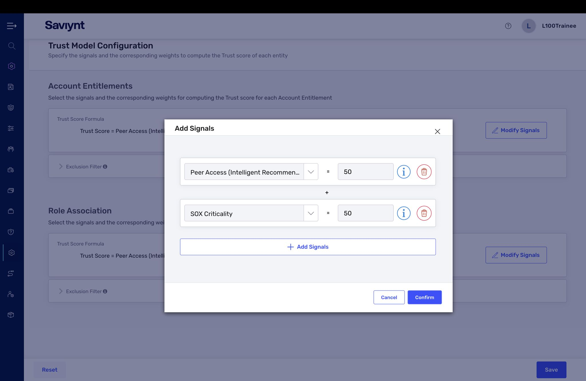
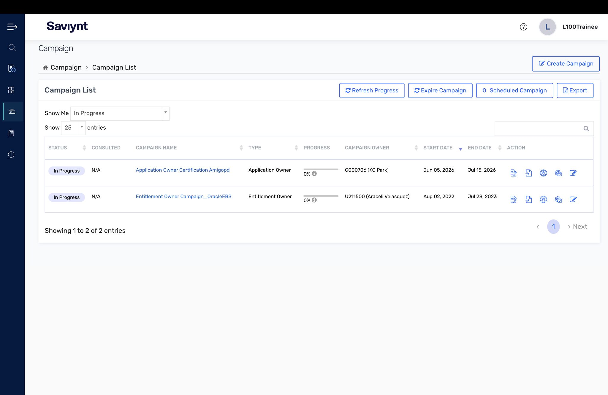
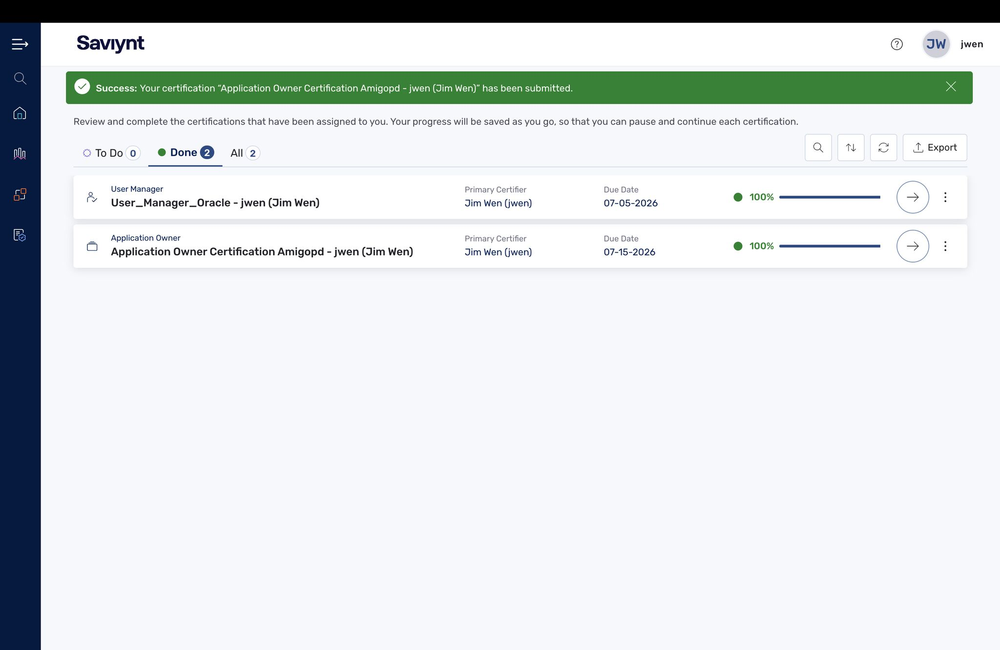
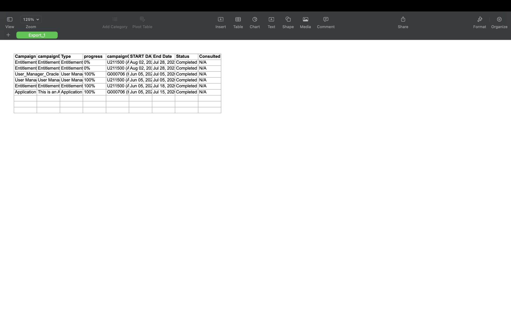
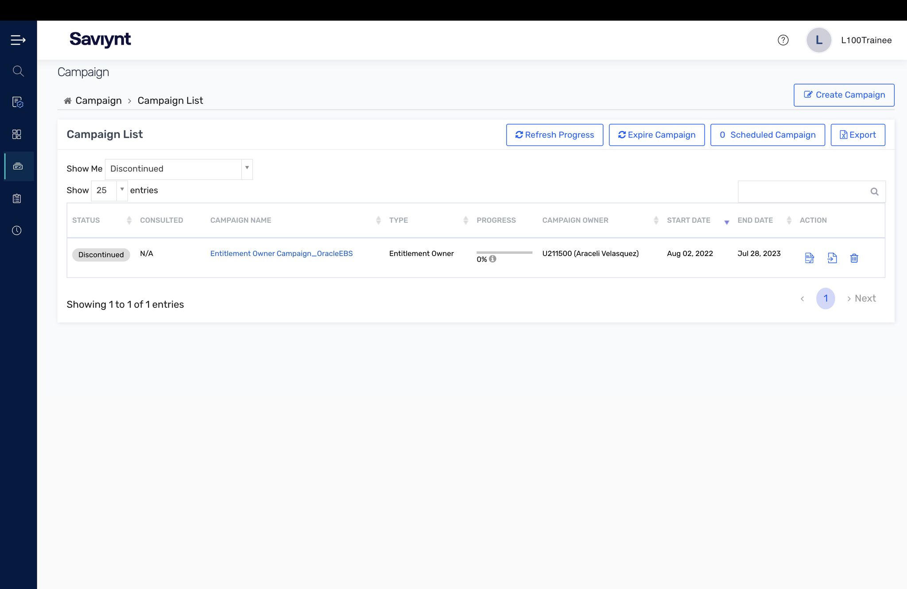

# Lab 7 — Access Certification

Granting access is easy. Proving it is still appropriate months later is the hard part, and it is what auditors actually ask for. This lab was about certification — the periodic access reviews that catch the access people accumulate but no longer need.

## What I did

- Configured the **Trust Model** by weighting signals (Peer Access intelligent recommendation + SOX Criticality) into a single trust score so certifiers see a confidence level instead of a raw list.
- Launched and tracked certification campaigns from the **Campaign list** (manager, entitlement-owner, and application-owner types).
- Completed assigned certifications from the **reviewer view** and confirmed submission.
- Exported the **campaign/certification report** — the audit evidence that proves the review happened and what was decided.

## Key concepts

- Who reviews matters as much as what is reviewed: managers, entitlement owners, and app owners each catch a different class of risk.
- A certification nobody can prove happened did not happen — the exported report is the deliverable.

