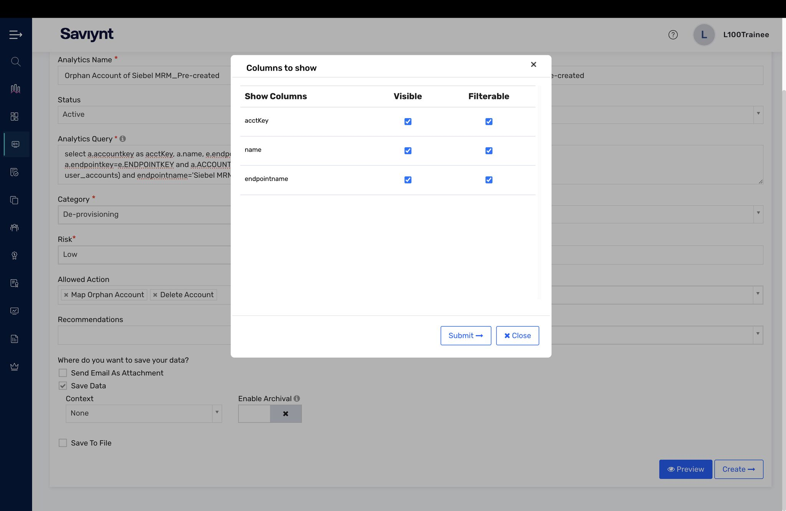
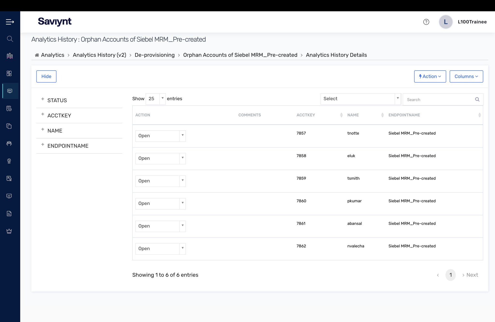
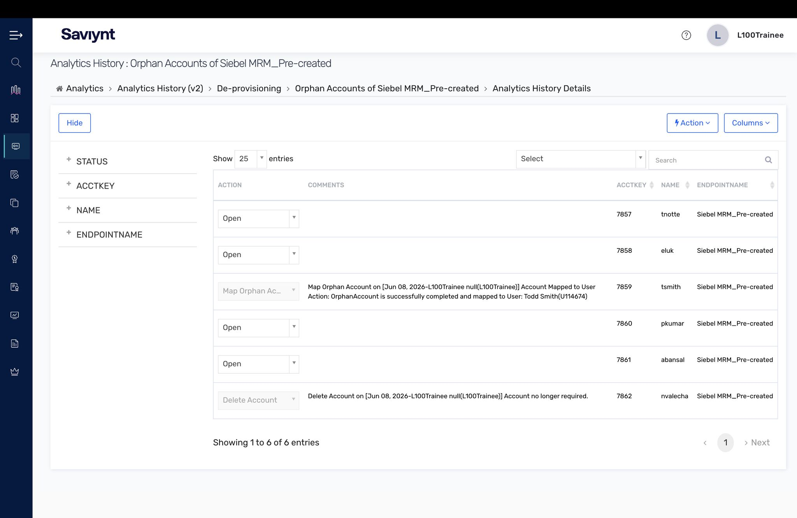
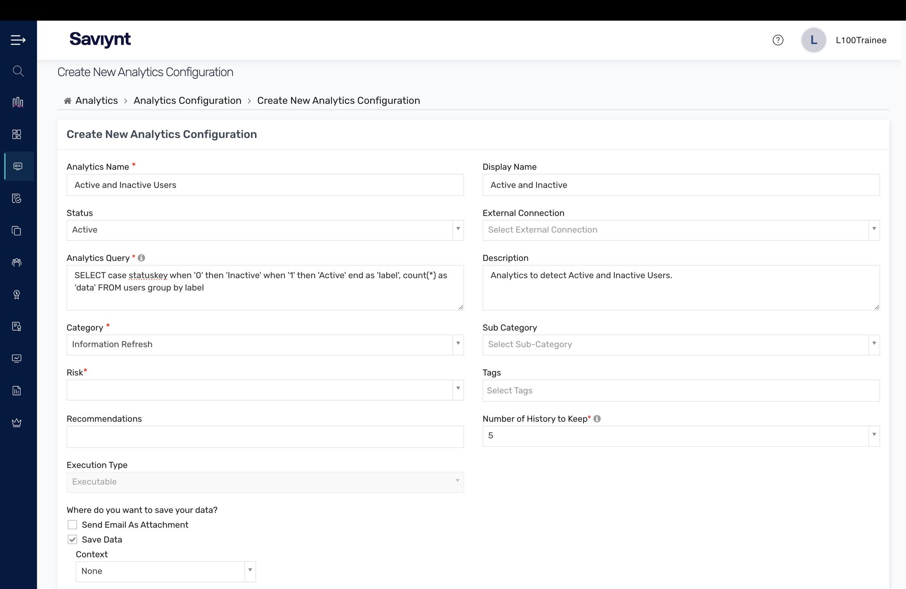
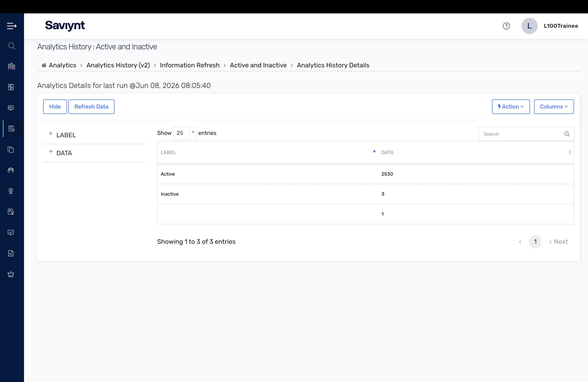

# Lab 8 — Intelligence & Analytics

All the identity data in the world is useless if you cannot ask it questions. This lab was the intelligence layer — writing analytics, surfacing risk like orphan accounts, and acting on it directly from the report.

## What I did

- Built an **orphan-account analytics** view (Orphan Accounts of Siebel MRM) and configured which columns surface.
- Reviewed the **analytics history** of flagged orphan accounts, then took remediation **actions directly from the report** — Map Orphan Account (tie it to a user) and Delete Account (when no longer needed).
- Created a **new analytics configuration** from scratch with a custom SQL query (Active and Inactive Users) and reviewed the resulting **analytics history** output.

## Key concepts

- Identity governance is shifting from "who approved this?" to "what does the data say about this?"
- Orphan accounts are the canonical invisible risk — nothing in the request/approval pipeline catches them; only analytics does.
- The detection-to-remediation loop closes inside one screen: surface the risk, then act on it.

