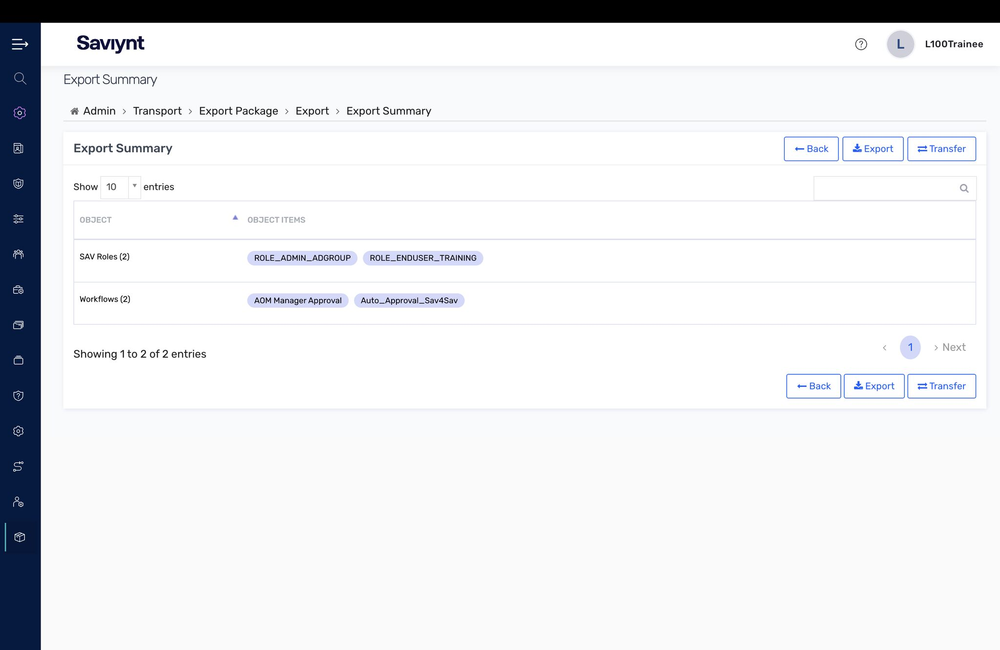
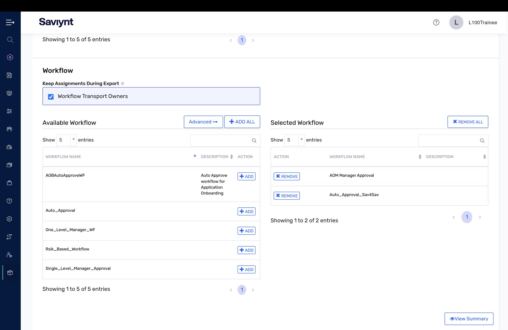

# Lab 9 — Administrator Functions (Transport)

The last lab in the L100 series, and a fitting one: how you safely move work between environments. You do not build configuration straight in production — you build it, test it, then transport it. Saviynt's Transport feature is exactly that, a controlled way to promote components from one instance to another.

## What I did

- Built an **Export Package**, selecting the components to promote — SAV Roles and Workflows — and chose to keep member assignments so nothing breaks on the other side.
- Reviewed the **Export Summary** (the package contents, object by object) before exporting the portable `.ZIP`.
- Configured the **Workflow transport** selection with transport owners preserved.

## Key concepts

- Transport is change management for identity: moving config from Test to Production through a packaged, reviewable, workflow-approved process is what keeps a production IGA environment stable and auditable.
- A real IGA program is not just clicking around one console — it is the disciplined promotion of tested configuration, the same change-management mindset good engineering teams live by.

